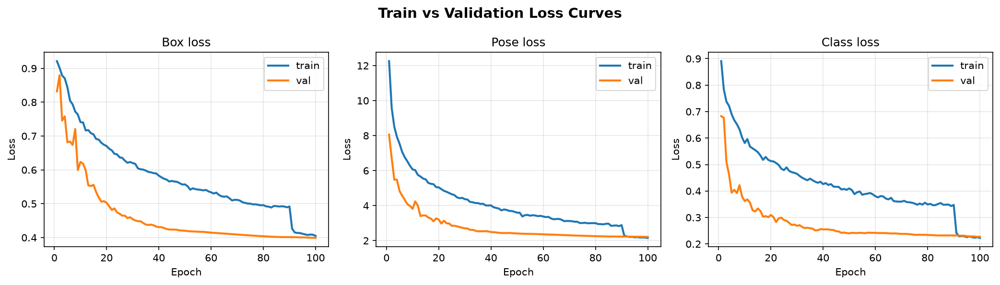

# Hand Pose Estimation Lab Analysis

YOLOv26 hand keypoint detection and tracking — TCDS Deep Learning assignment.

## Analytical Report

### 1. Hardware Profiling & Resource Metrics

* **Allocated Target Computing Device:** Kaggle Notebook NVIDIA GPU (T4/P100 class accelerator; training executed on Kaggle after Colab GPU quota was exhausted)
* **Configured Execution Batch Size:** `batch=16`
* **Absolute Processing Duration Spent Per Epoch:** 7 minutes

### 2. Performance Tracking Metrics Ledger (Best Validated Checkpoint)

* **Overall Training Budget Epochs Completed:** Epoch 100/100
* **Box Loss (box_loss):** 0.39889 (`val/box_loss` at epoch 100)
* **Pose Loss (pose_loss):** 2.21313 (`val/pose_loss` at epoch 100)
* **Class Loss (cls_loss):** 0.22705 (`val/cls_loss` at epoch 99)
* **Tracking Precision Score (Pose mAP50):** 0.87433 (`metrics/mAP50(P)` at epoch 100)
* **Rigorous Generalization Bound Score (Pose mAP50-95):** 0.72842 (`metrics/mAP50-95(P)` at epoch 100)

### 3. Optimization and Loss Landscape Analysis

Train vs. validation loss curves (logged per epoch in `runs/pose/train/results.csv`):

* **Critical Evaluation Reflection:**

  Validation losses (`val/box_loss`, `val/pose_loss`, `val/cls_loss`) decreased monotonically across the full training schedule, with the lowest validation pose loss (**2.213**) reached at **epoch 100**. There was no validation rebound in the final third of training; instead, metrics plateaued with small but steady improvements through epochs 80–100. The model **ran to the full allocated epoch limit (100/100)** and did **not** trigger early stopping (`patience=20` was never exhausted).

  A visible discontinuity appears around **epoch 90** in the training curves, consistent with YOLO's default `close_mosaic=10` behavior (mosaic augmentation disabled for the final 10 epochs). This explains the sharp drop in training losses at epoch 91 while validation losses continued a gradual decline.

  **Advanced optimization configuration** (vs. the Phase 1 generic pretrained baseline in `failed_attempt.mp4`):
  - **AdamW** optimizer with `lr0=0.002` and **cosine LR annealing** (`cos_lr=True`) for smoother late-stage convergence than factory-default SGD scheduling
  - **Amplified pose loss weight** (`pose=18.0`) to prioritize finger-joint accuracy over box localization (`box=5.0`)
  - **Scale augmentation** (`scale=0.6`) to regularize for variable hand distance from the webcam
  - **Extended warmup** (`warmup_epochs=4.0`) for optimizer stability early in training

  Compared to the Phase 1 baseline recording (`runs/pose/predict/failed_attempt.mp4`), which used the untrained generic `yolo26n-pose.pt` weights and produced unstable or missing hand keypoints on the live webcam feed, the fine-tuned `best.pt` model (`runs/pose/predict/successful_attempt.mp4`) tracks **21 hand keypoints** substantially more consistently, with tighter finger joint alignment and fewer dropped detections during movement.

  **Note on experiment tracking:** Weights & Biases login was configured, but Ultralytics W&B integration requires `settings.update(wandb=True)` before `model.train()` and was not enabled in the notebook. Metrics and curves were therefore exported from `results.csv` using `analyze_results.py`.

---

## Repository Artifacts

| Artifact | Path |
|----------|------|
| Baseline webcam recording (pretrained) | `runs/pose/predict/failed_attempt.mp4` |
| Optimized webcam recording (fine-tuned) | `runs/pose/predict/successful_attempt.mp4` |
| Best model weights | `runs/pose/train/weights/best.pt` |
| Training metrics | `runs/pose/train/results.csv` |
| Loss curve plot | `runs/pose/train/training_curves.png` |
| Lab notebook | `hand_pose_lab.ipynb` |
| Inference script | `detect.py` |
